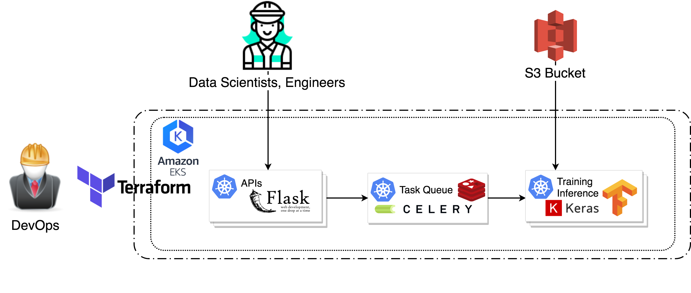

# Sherlock
Sherlock is a Transfer Learning as a Service Platform that allows users to create an image classifier for custom images, based on pre-trained CNN models. It also allows to use the customized CNN to pre-label images, and re-train the customized CNN when more training data become available.

[Here](http://bit.ly/sherlock_kai) are the slides for project Sherlock.

---
## Development
Everything is wrapped in Docker, here are the core packages used in *Sherlock*.
* Python 3.6
* Gunicorn + Flask
* Celery + Redis
* Keras 2
* Tensorflow 1.12


## Requirements
- Terraform : https://learn.hashicorp.com/terraform/getting-started/install.html  
- AWS-IAM   : https://docs.aws.amazon.com/eks/latest/userguide/install-aws-iam-authenticator.html  
- Kubectl   : https://kubernetes.io/docs/tasks/tools/install-kubectl  
- Subscribe to EKS-optimized GPU AMI    : https://aws.amazon.com/marketplace/pp/B07GRHFXGM  
- NVIDIA device plugin for Kubernetes   : https://github.com/NVIDIA/k8s-device-plugin  
- AWS Credential: Export AWS_ACCESS_KEY_ID and AWS_SECRET_ACCESS_KEY to Host Environment


## Platform Architecture


---

## DevOps:
#### 1. Provision Platform on EKS  
The following step spins up an AWS EKS cluster with multiple instances. It will take ~15 mins to set up the cluster.
```bash
cd terraform
terraform init
terraform apply
```

#### 2. Check Kubernetes Status
Check the status of Kubernetes cluster within all namespace.
```bash
kubectl get all --all-namespaces
```
More kubectl commands [kubectl Cheat Sheet](https://kubernetes.io/docs/reference/kubectl/cheatsheet/)

#### 3. Destroy Platform
The following command stops the platform and destroys the EKS cluster. It will take ~10 mins to complete.
```bash
terraform destroy
```

---

## Data Scientists/Engineers
*Sherlock* is currently serving as RESTful APIs, provides 3 major APIs.  
To test *Sherlock*, I recommend testing the APIs using [Postman](https://www.getpostman.com/). The examples below are in terminal, using `cURL`

#### 1. Welcome Page
If *Sherlock* is running correctly, go to `http://<PLATFORM-IP>:<PORT>/` in your web browser, you should see the welcome message of *Sherlock*.
```json
{
  "msg": "Welcome Sherlock",
  "status": 200,
  "time": "2019-02-18 23:43:41"
}
```

#### 2. Create a New Model Using Custom Image Dataset:
*Sherlock* can do transfer learning on the pre-trained InceptionV3 CNN (without the top layer), and create a new CNN for users' image dataset.  
**The S3 folders should have public access permission and architecture should look like this**
```
.
├── YOUR_BUCKET_NAME
│   ├── YOUR_BUCKET_PREFIX
│       │── train
│           ├── class1
│           ├── class2
.           .
│       │── val
│           ├── class1
│           ├── class2
.           .
```
- *YOUR_BUCKET_NAME* : Your S3 bucket name.
- *YOUR_BUCKET_PREFIX* : Path to point your folder which includes training and validating folder.
- *YOUR_MODEL_NAME* : Your preferred model name that will be used to identify this model once it is trained.

The name of train and val folders **can't be changed**.  
The folder names for different classes will be used as the label of the class. You can create as many class folders as you want.

Usage:
```bash
curl -X POST \
  http://<PLATFORM-IP>:<PORT>/inceptionv3/transfer \
  -F bucket_name=YOUR_BUCKET_NAME \
  -F bucket_prefix=YOUR_BUCKET_PREFIX \
  -F model_name=YOUR_MODEL_NAME
```

Return:
```json
{
    "msg": {
        "action": "transfer",
        "check_status": "/info/d6cf17d4-9539-4024-a111-0a0dccfad67e",
        "model": "InceptionV3",
        "task_id": "d6cf17d4-9539-4024-a111-0a0dccfad67e"
    },
    "status": 200,
    "time": "2019-02-18 10:16:39"
}
```


#### 3. Labeling new images:
Once transfer learning is finished, you can use the newly created model to label your new images. The new image folder should also be hosted in S3. Please structure your folder like this:
```
.
├── YOUR_BUCKET_NAME
│   ├── YOUR_BUCKET_PREFIX
│       ├── img1
│       ├── img2
│       ├── img3
│       ├── img4
│       ├── img5
│       ├── img6
.       .
```

Usage:
```bash
curl -X POST \
  http://<PLATFORM-IP>:<PORT>/inceptionv3/label \
  -F bucket_name=YOUR_BUCKET_NAME \
  -F bucket_prefix=YOUR_BUCKET_PREFIX \
  -F model_name=YOUR_MODEL_NAME
```

Return:
```json
{
  "msg": {
    "action": "label",
    "check_status": "/info/3b5779b3-6e9c-4ca1-a87c-88c0ebba83e1",
    "model": "InceptionV3",
    "task_id": "3b5779b3-6e9c-4ca1-a87c-88c0ebba83e1"
  },
  "status": 200,
  "time": "2019-02-19 00:12:03"
}
```


#### 4. Resume training on an Existing Model:
Once more labeled images become available, you can retrain existing models by submitting additional model folders.  
The S3 bucket architecture should be the same as the one used by the transfer learning API.  
The retraining API is pretty similar to the one used in the transfer learning API.

Usage:
```bash
curl -XPOST \
  http://<PLATFORM-IP>:<PORT>/inceptionv3/retrain \
  -F epochs=EPOCHS \
  -F batch_size=BATCH_SIZE \
  -F bucket_name=YOUR_BUCKET_NAME \
  -F bucket_prefix=YOUR_BUCKET_PREFIX \
  -F model_name=YOUR_MODEL_NAME
```

Return:
```json
{
  "msg": {
    "action": "retrain",
    "check_status": "/info/7de0e973-4b3c-4338-a377-8556dda2f1a6",
    "model": "InceptionV3",
    "task_id": "7de0e973-4b3c-4338-a377-8556dda2f1a6"
  },
  "status": 200,
  "time": "2019-02-19 00:02:46"
}
```
#### 5. Retrieve Status and Result:
*Sherlock* is event-based system. Once the task has been submitted, you can get a Task ID to track the status.

Usage:
```bash
curl http://<PLATFORM-IP>:<PORT>/info/<TASK-ID>
```

Status(still in process):
```json
{
  "msg": {
    "result": {
      "Step": "2/4"
    },
    "status": "Training Model"
  },
  "status": 200,
  "time": "2019-02-19 00:20:43"
}
```

Result(if completed):
```json
{
  "msg": {
    "result": {
      "train_acc": 0.75028169014084506,
      "val_acc": 0.70653061224489793
    },
    "status": "SUCCESS"
  },
  "status": 200,
  "time": "2019-02-19 00:26:37"
}
```

---
## Current Restriction of Kubernetes with GPUs
* GPUs are only supposed to be specified in the limits section, which means:
    * You can specify GPU limits without specifying requests because Kubernetes will use the limit as the request value by default.  
    * You can specify GPU in both limits and requests but these two values must be equal.
    * You cannot specify GPU requests without specifying limits.
* Containers (and pods) do not share GPUs. There’s no overcommitting of GPUs.
* Each container can request one or more GPUs. It is not possible to request a fraction of a GPU.

More Information [Schedule GPU on Kubernetes](https://kubernetes.io/docs/tasks/manage-gpus/scheduling-gpus/)

## References
AWS VPC guide: https://docs.aws.amazon.com/vpc/latest/userguide/what-is-amazon-vpc.html  
EKS with GPU support: https://docs.aws.amazon.com/eks/latest/userguide/gpu-ami.html  
Kubernetes Dashboard: https://github.com/kubernetes/dashboard  


 


